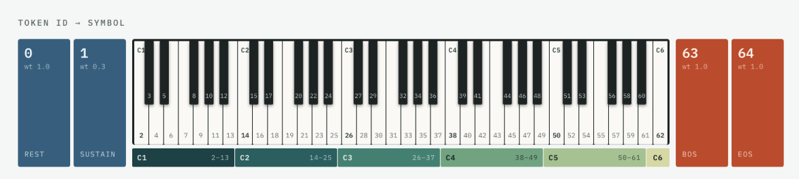
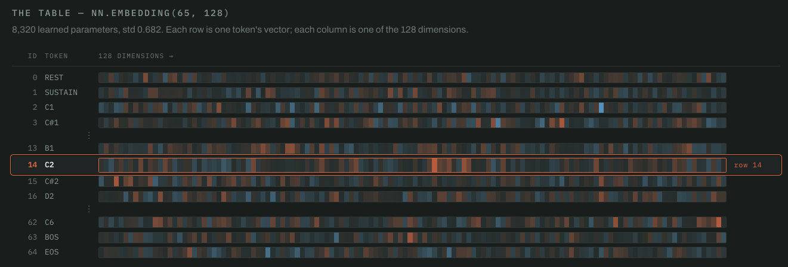
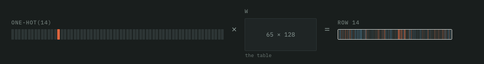
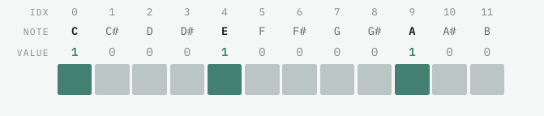
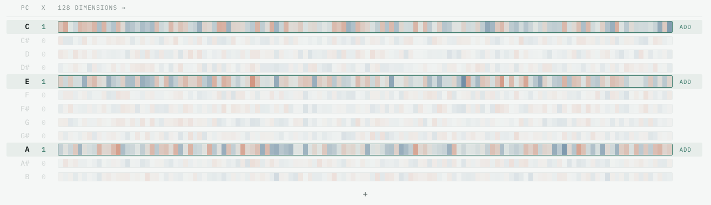
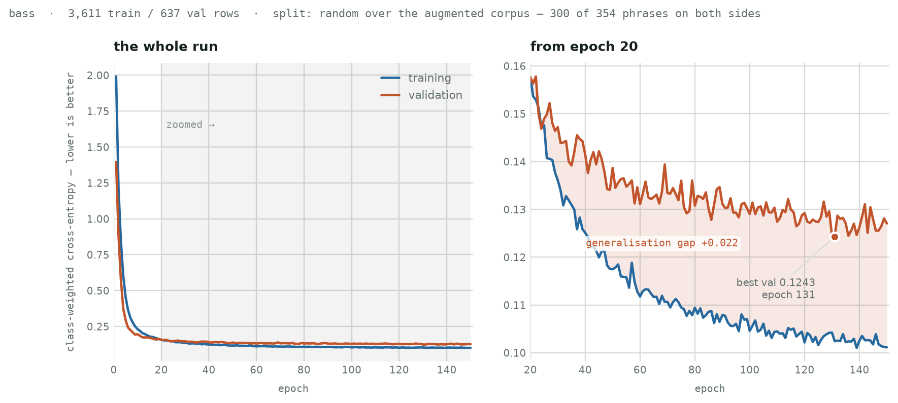
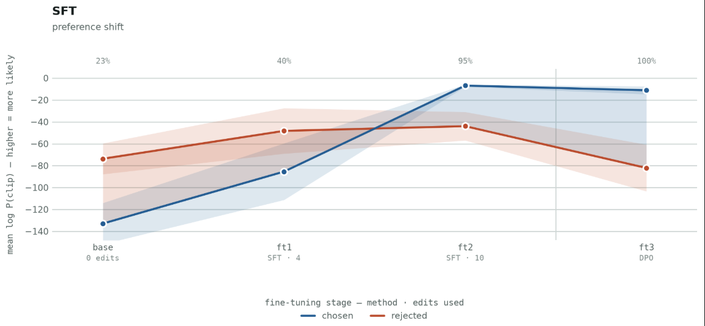
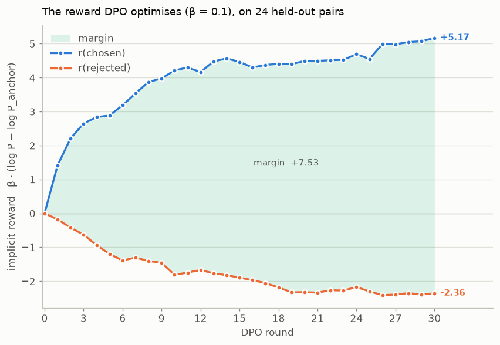

**Midi GPT**


A small language model that generates MIDI, trained on a curated data set, and fine tuned further through Direct Preference Optimization.


**Motivation**


I produce electronic music, and need a tool to help me get past creative blocks. A short musical pattern is often enough to build into something bigger. Existing MIDI generators produce outputs that are not in my style or voice. Midi GPT is aimed at a narrow slice of EDM and can be further fine tuned to a user's preference. 


**Data Preparation**


I trained two models, one for bass and one for melody. I curated a collection of MIDI patterns from House and UK Garage.


Each training example is one 4-bar phrase, reduced to a single voice and written as one token per sixteenth note indicating a pitch, a rest, or a sustain. A distilled representation of music pinned to rhythm and pitch.


Each chunk carries two additional signals derived from itself: **grid** (its own note-ons) and **chord** (inferred per bar by matching a pitch-class histogram against chord templates). The corpus is thus self-supervised.


Every chunk is transposed through all twelve keys - 354 unique bass phrases become 4,248 training examples, and 288 melody phrases become 3,456.  This data augmentation also removes the correlation between rhythm being tied to a certain pitch, so that the model doesn't overfit rhythm with pitch.


**Token Vocabulary**


The vocabulary is 65 symbols: REST = 0, SUSTAIN = 1, 61 pitches (MIDI 24–84, C1 through C6), then BOS - (Beginning of Sequence) = 63 and EOS (End of Sequence) = 64.  The tokenization is a direct mapping mapping of the symbol to token id.



The model has a simple job at each step — output a pitch, a rest, or a sustain.  The sequence [2, 1, 1, 1] is note C1 sustained for a quarter note (each step is a 1/16th note). The resulting midi is edited in a digital audio workstation. 

**Embedding**

A learned embedding layer converts the token ids to a 128 dimension embedding vector.  Using W as NN.Embedding(65, 128), looking up row 14, which corresponds to note C2, is the same as one hot encocded (14) @ W.  The weights of W are updated during training.  
 
  
A similar lookup opertation is performed to convert position (step) index into a position embedding.

Chords are represented by a chord chroma depicted below.  Each index corresponds to a note, and a chord is the composition of multiple notes.  


The chord is projected into an embedding vector through matrix multiplication with a linear layer (NN.Linear(12, 128)). The resulting operation is represented by:  chord_proj(A minor) = W[:,C] + W[:,E] + W[:,A] + b


The grid is a scalar value 0 or 1, for each timestep, projected through a linear layer.  

**Input Embedding**

The token embedding is enriched with signals from the position (current step), the grid projection (rhythm conditioning), and the chord projection (what chord is playing at the current step). The input embedding is:


x = tok_emb + pos_emb + grid_proj + chord_proj

The position embedding represents order, where the current step sits in the sequence. The grid projection is the note onset pattern or rhythm.  At training time it is derived from the stem's own note-ons, and at inference it comes from the kick track of a user-selected drum groove — four-on-the-floor house or two-step UK Garage.

The chord projection is a 12-dimensional chroma vector. At training time it is inferred from the training example itself. At inference it is derived deterministically from the user's key and progression. 

Below is a summary on how the four signals get converted into 128 dimension embedding vector.  The four vectors are then summed. 

| signal | shape in | how it becomes 128-d |
| --- | --- | --- |
| token | 1 id (0–64) | `nn.Embedding(65, 128)` — the id indexes a row |
| position | 1 index (0–67) | `nn.Embedding(68, 128)` — the step indexes a row |
| grid | 1 scalar (0 or 1) | `nn.Linear(1, 128)` — one weight vector scaled by the onset |
| chord | 12-d chroma | `nn.Linear(12, 128)` — a learned map from pitch classes |

**Transformer**

The backbone is a small GPT-2. At roughly 700k parameters, the model can easily run on a laptop.

| key | value | what it is |
| --- | --- | --- |
| `n_layers` | 3 | transformer blocks |
| `n_heads` | 4 | attention heads per block, 32 dimensions each |
| `emb_dim` | 128 | model width — every signal is projected to this |
| feed-forward | 512 | hidden width inside each block, 4 × `emb_dim` |
| `context_length` | 68 | BOS + 64 steps + EOS, with room to spare |
| `vocab_size` | 65 | REST, SUSTAIN, 61 pitches, BOS, EOS |
| `drop_rate` | 0.1 | |
| `qkv_bias` | False | |

That comes to 686,848 parameters, 593,664 of them — 86% — in the three transformer blocks.
The embeddings, the four projections and the output head account for well under a tenth of
the model between them.

One line of that table is a lie of omission: 65,664 parameters sit in `cond_proj`, a CLAP
audio-conditioning path that is never activated. Every call passes `cond=None`. The layer
is retained only because it exists in the trained checkpoints' state dictionaries, so the
model that actually runs is 621,184 parameters.


**Training**

Training is teacher-forced. A single forward pass covers all 65 positions at once with a causal mask preventing lookahead, so an epoch is fast even on a laptop CPU. AdamW, learning rate 5e-4, weight decay 0.05, batch size 16, 150 epochs, 15% held out for validation, best validation loss kept.

`train_notes.py` records only that best validation figure, so the shipped runs left no curve
behind. The one below is a retrain from scratch at the same hyperparameters, kept for its
per-epoch history and nothing else — 150 epochs of bass in about seven and a half minutes on
an M-series GPU.



Most of the drop happens in the first fifteen epochs — cross-entropy falls from 2.0 to about
0.18 — and from roughly epoch 40 the run is grinding out small improvements. Validation
bottoms at 0.1243 on epoch 131 and drifts up slightly afterwards. That drift is the mild
overfitting the best-validation checkpoint exists to catch.

The gap of +0.022 is flattering, though, and worth being honest about. The split is a random
one taken *after* the twelve-key augmentation, so a phrase's transpositions land on both
sides of the line: 300 of 354 phrases appear in training and validation both. Since the
augmentation exists precisely to make the model key-invariant, a transposed sibling is very
nearly the same example from the model's point of view. This is close to a best case, and
the true gap on phrases the model has never heard in any key is wider.

**SFT**


From the base checkpoint, I generated 10 outputs, and edited them to my preference.  These edits were transposed through a range of 12 semitones and concatented with the existing corpus into a shuffled loader for SFT.  This mixture, along with a low learning rate (1e-4), and only 8 epochs, limits drift from the base model.  As seen below, the goal is to subtly shift the distribution towards the preference, but not destroy the base model.





**DPO Fine Tune**


DPO fine-tunes further toward the user's preference. It optimises an implicit reward — how much more likely the policy makes a clip than the frozen anchor does — and widens the gap between that reward for the clip you kept and the clip you replaced, while a KL term holds the policy near the anchor. Which half moves matters: the gap widens either by making your edit more likely or by making the original less likely, and since the rejected clip is on-policy, pushing it down suppresses the general distribution.


sequence_logprob sums the per-step log probabilities of one exact clip — how likely the model was to produce that precise sequence, under the grid and chord it was conditioned on (g and c below). The policy is the model being trained; it starts as the checkpoint that generated the clip. The anchor is frozen, and by default it is the untuned base model rather than whichever checkpoint you started from, so drift is measured from one fixed place instead of compounding across rounds. Both models score both clips — hence the four lines.


```python
policy_chosen   = sequence_logprob(policy, xc, yc, g, c)
policy_rejected = sequence_logprob(policy, xr, yr, g, c)
anchor_chosen   = sequence_logprob(anchor, xc, yc, g, c)   # frozen
anchor_rejected = sequence_logprob(anchor, xr, yr, g, c)   # frozen


margin = beta * ((policy_chosen - anchor_chosen)
                - (policy_rejected - anchor_rejected))
loss   = -F.logsigmoid(margin).mean() + lam * kl_to_anchor(policy, contexts)
```



