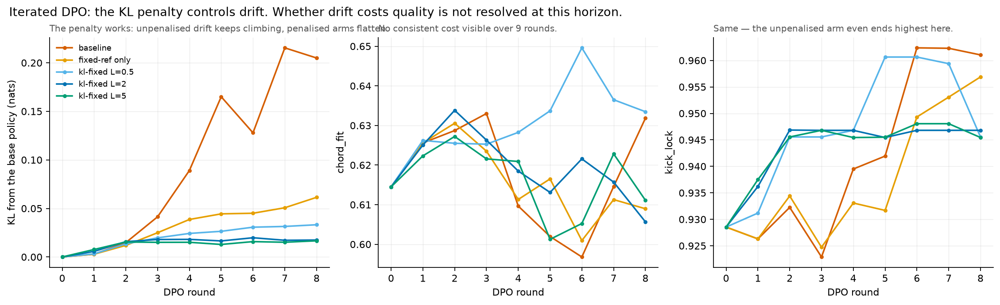

**Midi GPT**


A small language model that generates MIDI, trained on a curated data set, and fine tuned further with Direct Preference Optimization.


**Motivation**


I produce electronic music, and need a tool to help me get past creative blocks. A short musical pattern is often enough to build into something bigger. Existing MIDI generators produce outputs that are not in my style or voice. Midi GPT is aimed at a narrow slice of EDM and can be further fine tuned to a user's preference. 


**Data Preparation**


I trained two models, one for bass and one for melody. I curated a collection of MIDI patterns from House and UK Garage.


Each training example is one 4-bar phrase, reduced to a single voice and written as one token per sixteenth note indicating a pitch, a rest, or a sustain. A distilled representation of music pinned to rhythm and pitch.


Each chunk carries two additional signals derived from itself: **grid** (its own note-ons) and **chord** (inferred per bar by matching a pitch-class histogram against chord templates). The corpus is thus self-supervised.


Every chunk is transposed through all twelve keys - 354 deduplicated bass source files become 4,248 training examples, and 288 melody files become 3,456.  This data augmentation also removes the correlation between rhythm being tied to a certain pitch, so that the model doesn't overfit rhythm with pitch.

Those source-file counts are not phrase counts, which turns out to matter a great deal. Hold that thought until the training section.


**Token Vocabulary**


The vocabulary is 65 symbols: REST = 0, SUSTAIN = 1, 61 pitches (MIDI 24–84, C1 through C6), then BOS - (Beginning of Sequence) = 63 and EOS (End of Sequence) = 64.  The tokenization is a direct mapping of the symbol to token id.


The model has a simple job at each step — output a pitch, a rest, or a sustain.  The sequence [2, 1, 1, 1] is note C1 sustained for a quarter note (each step is a 1/16th note). The resulting midi is edited in a digital audio workstation. 

**Embedding**

Every token id becomes a 128-d vector by indexing a row of `nn.Embedding(65, 128)` — row 14 is C2. The lookup is exactly `one_hot(14) @ W`.


Position indexes its own table, similar to the token id look up. Grid and chord are projected rather than looked up, since their inputs are values, not ids. A chord is a 12-slot chroma, one slot per pitch class:


`nn.Linear(12, 128)` maps it up, which for A minor is just three columns and a bias:

chord_proj(A minor) = W[:,C] + W[:,E] + W[:,A] + b


All four land in the same 128-d space and are summed:

x = tok_emb + pos_emb + grid_proj + chord_proj

| signal | shape in | how it becomes 128-d |
| --- | --- | --- |
| token | 1 id (0–64) | `nn.Embedding(65, 128)` — the id indexes a row |
| position | 1 index (0–67) | `nn.Embedding(68, 128)` — the step indexes a row |
| grid | 1 scalar (0 or 1) | `nn.Linear(1, 128)` — one weight vector scaled by the onset |
| chord | 12-d chroma | `nn.Linear(12, 128)` — a learned map from pitch classes |

Grid and chord are user-provided signals to condition the output. In training both come from the phrase itself — the stem's own note-ons, and the chroma inferred per bar. At inference the grid comes from the kick of a chosen drum groove, four-on-the-floor house or two-step UK Garage, and the chord from your key and progression.

**Transformer**

The backbone is a small GPT-2. At 621,184 parameters, the model can easily run on a laptop. (A checkpoint file sums to 700,720 — the extra is a retired `Linear(512, 128)` that every shipped checkpoint still carries as untouched init, plus three causal masks, which are buffers rather than parameters.)

| key | value | what it is |
| --- | --- | --- |
| `n_layers` | 3 | transformer blocks |
| `n_heads` | 4 | attention heads per block, 32 dimensions each |
| `emb_dim` | 128 | model width — every signal is projected to this |
| feed-forward | 512 | hidden width inside each block, 4 × `emb_dim` |
| `context_length` | 68 | BOS + 64 steps + EOS, with room to spare |
| `vocab_size` | 65 | REST, SUSTAIN, 61 pitches, BOS, EOS |
| `drop_rate` | 0.1 | |
| `qkv_bias` | False | |


**Training**

Training is teacher-forced.  A causal mask prevents look ahead attention. AdamW, learning rate 5e-4, weight decay 0.05, batch size 16, 150 epochs, 15% held out for validation, best validation loss kept.

Training took about seven and a half minutes on an M-series GPU — 7.2 minutes measured, at a median 2.89s per epoch including validation. On the CPU the same run takes 12.8 minutes.

That ordering is the reverse of generation, where the CPU is 8.3× *faster* than MPS, and the reason is worth a sentence because it is the same model on the same machine. Training is teacher-forced: sixteen examples, all sixty-five positions, one kernel launch doing 1,040 positions of work. Generation is one sequence, one token at a time: sixty-four launches doing one position each. The accelerator wins when a launch carries enough work to pay for itself and loses when it does not.

Most of the drop happens in the first fifteen epochs — cross-entropy falls from 2.0 to about
0.18 — and from roughly epoch 40 the run is grinding out small improvements. Validation
bottoms at 0.1243 on epoch 131 and drifts up slightly afterwards.


*The orange curve is labelled "validation" but nothing in it was held out — see below. Read it as a second training curve drawn on a different random 15% of the same rows.*

The +0.022 gap is not flattering, it is meaningless, and working out why was the most useful thing I did on this project.

The split is random over the augmented corpus, so the twelve keys of a phrase scatter across both sides — and since the augmentation exists precisely to make those equivalent, they are very nearly the same example. I knew that much when I wrote the figure. What I had not checked was where the corpus came from.

It came from a folder of multitrack arrangements that had *already* been transposed into twelve keys before I ever mined it. Content hashing deduplicates identical bytes, and transposing a MIDI file changes every byte, so twelve copies of one bassline sailed through as twelve distinct basslines — and then `mine_corpus.py` transposed each of them twelve more times. What I had been calling 354 unique bass phrases is **45**. A third of the training examples are byte-identical to another example.

So the split does not leak a little. Counting against the shipped data with the trainer's own seed: **100% of validation examples have another key of their own source file in train, 42% have a byte-identical twin, and zero phrases are held out**. There is no validation set. The +0.022 is a train-train gap.

Three things convinced me this was real rather than a bug in my audit: grouping examples by source path gives 45; grouping them by their rhythm array gives 38 distinct rhythms, and transposition preserves rhythm exactly; and mining the *un*-augmented source directly yields 45 phrases and 540 examples with no duplicates at all. The README's own table had been reporting "distinct rhythms: 40" three rows under "distinct phrases: 72" the entire time, which is the part I find least comfortable.

I have not retrained. The models work, they are what generates the audio above, and a corrected loss number is not worth disturbing them for. `train_notes.py --split-by family` now groups on phrase identity and holds out 7 of the 45 phrases with zero overlap, so the mechanism is there for the next run. But the honest statement today is that this project has no measured generalisation gap — not that it has a good one.

**SFT**


From the base checkpoint, I generated 10 outputs, and edited them to my preference.  These edits were transposed through a range of 12 semitones and concatented with the existing corpus into a shuffled loader for SFT.  This mixture, along with a low learning rate (1e-4), and only 8 epochs, limits drift from the base model.  As seen below, the goal is to shift the distribution towards the preference, but not destroy the base model.


**DPO Fine Tune**


DPO fine-tunes further toward the user's preference. It optimises an implicit reward — how much more likely the policy generates a clip than the frozen anchor does — and widens the gap between that reward for the clip you kept and the clip you replaced, while a KL term holds the policy near the anchor. 


sequence_logprob sums the per-step log probabilities of one exact clip — how likely the model was to produce that precise sequence, under the grid and chord it was conditioned on (g and c below). The policy is the model being trained; it starts as the checkpoint that generated the clip. The anchor is frozen, and by default it is the untuned base model.  Drift is measured from the base checkpoint instead of compounding across rounds. 


```python
policy_chosen   = sequence_logprob(policy, xc, yc, g, c)
policy_rejected = sequence_logprob(policy, xr, yr, g, c)
anchor_chosen   = sequence_logprob(anchor, xc, yc, g, c)   # frozen
anchor_rejected = sequence_logprob(anchor, xr, yr, g, c)   # frozen


margin = beta * ((policy_chosen - anchor_chosen)
                - (policy_rejected - anchor_rejected))
loss   = -F.logsigmoid(margin).mean() + lam * kl_to_anchor(policy, contexts)
```


**Does the KL term actually hold?**


Running DPO once is safe. Running it every time you edit a clip is the thing this project is actually for, and that is where a policy walks away from the distribution it started in. So I ran nine rounds under five settings: no penalty with the anchor re-pinned each round, no penalty with the anchor frozen at round 0, and a fixed KL weight at three strengths.



The left panel is the result. Unpenalised, KL from the base policy reaches 0.205 nats by round 8 and is still climbing; any fixed weight flattens it, with L=2 and L=5 both settling at 0.017 — an order of magnitude lower, and flat rather than merely slower.

The right two panels are the part I had expected to be the payoff, and they are not. Over nine rounds `chord_fit` and `kick_lock` wander inside a narrow band with no consistent ordering between the arms, and the *unpenalised* run finishes highest on `kick_lock`. So this experiment shows the penalty controls drift. It does not show that uncontrolled drift costs anything measurable — nine rounds on ten pairs is a short horizon, and these two metrics measure constraint satisfaction rather than whether the result is any good. Both panels are in the figure because leaving them out would have made the first panel look like it proved more than it does.


**Does any of it work?**


Two questions, and they have different answers.

*Does the conditioning do anything?* Yes, and the way to show it is to take it away. The same checkpoint, given a zeroed kick grid and zeroed chroma, then scored against the real conditioning it was never shown:

| System (bass) | chord_fit | kick_lock |
| --- | --- | --- |
| Random legal tokens | 0.354 ±0.007 | 0.083 ±0.007 |
| Bigram over the corpus | 0.463 ±0.013 | 0.124 ±0.013 |
| Model, unconditioned | 0.472 ±0.019 | 0.186 ±0.027 |
| **Model (ft3)** | **0.937 ±0.010** | **0.886 ±0.015** |
| Human corpus | 0.904 ±0.022 | 0.780 ±0.035 |

n=240, best-of-10, ±1 SE clustered by phrase, since twelve keys of one phrase are one sample rather than twelve.

Conditioning is worth 0.465 chord_fit and 0.700 kick_lock. The bigram row is the useful control: it learns which note follows which and nothing about rhythm, and lands barely above random on kick_lock, which is exactly the shape it should have.

The bottom row is the one I would rather not print. The model scores *above* human-authored MIDI on both metrics. That is not a claim about musicality — it is a claim about my metrics, and the honest reading is that they are gameable and I game them: best-of-10 selects on `2·chord_fit + kick_lock + density`, so the model is chosen under the objective it is then scored on. `chord_fit` and `kick_lock` measure constraint satisfaction. They are silent about whether anything sounds good, which is why the clips are at the top of this post.

*Did the preference tuning learn taste?* Unknown, and probably not yet.

| | training pairs (n=10) | held out (n=1) |
| --- | --- | --- |
| base | 23% | 0% |
| ft1 | 40% | 0% |
| ft2 | 95% | 0% |
| ft3 | **100%** | **0%** |

On the pairs it was fit on, the model ends up preferring my edit every single time. On the one clip it never saw, it prefers its own output at every stage, and the margin sits around −90 to −120 nats throughout rather than trending anywhere.

With n=1 that 0% is not a result — one clip cannot separate "learned nothing transferable" from "unlucky draw". What it does establish is that the 100% column is evidence of absorption and nothing else, which is precisely what someone would otherwise read into it. A real answer needs about 30 held-out pairs. The code to collect them is in the fine-tuning tab; what is missing is the edits.

There is also a floor under this measurement I cannot lift without changing the representation: 2 of the 10 training pairs tokenize *identically* to the clip they were meant to improve, because those edits were velocity and sub-grid timing. One token per sixteenth cannot express either. A fifth of the editing effort went into changes the preference objective is structurally blind to.
